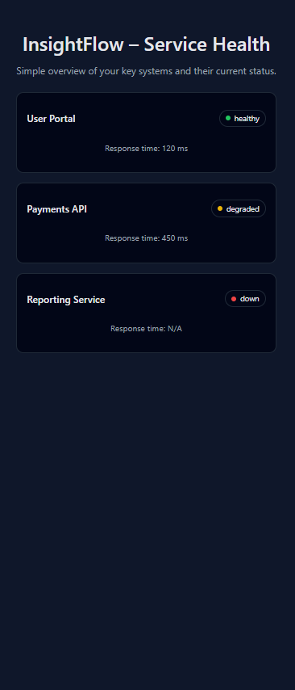

InsightFlow – Service Health Dashboard

InsightFlow is a lightweight monitoring dashboard that displays the real-time health of internal systems and APIs.
It includes a Node.js backend that simulates service status and a React frontend that visualizes performance metrics.

🚀 Features

Backend API built with Node.js + Express

Frontend dashboard built with React + Vite

Real-time service status (healthy / degraded / down)

Response-time monitoring

Clean, modern UI with status badges

Ready for deployment on Vercel / Netlify / Render / AWS

📦 Project Structure
insightflow-dashboard/
│
├── server.js           # Express backend
├── package.json
│
├── client/             # React frontend
│   ├── src/
│   ├── index.html
│   └── vite.config.js

🛠️ Running the backend
cd insightflow-dashboard
node server.js

Backend runs on:
👉 http://localhost:5000

🖥️ Running the frontend
cd insightflow-dashboard/client
npm run dev

Frontend runs on:
👉 http://localhost:5173

📡 API Endpoint Example
GET /api/services

Response:

{
  "services": [
    { "id": 1, "name": "User Portal", "status": "healthy", "responseTimeMs": 120 },
    { "id": 2, "name": "Payments API", "status": "degraded", "responseTimeMs": 450 },
    { "id": 3, "name": "Reporting Service", "status": "down", "responseTimeMs": null }
  ]
}

📘 Roadmap

Add authentication

Connect to real APIs

Add charts & analytics

Add alerting system (email/SMS)

📄 License

MIT License